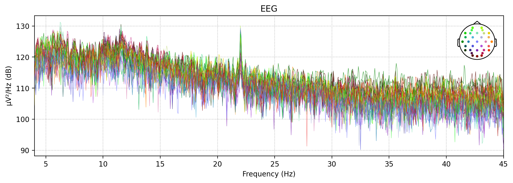
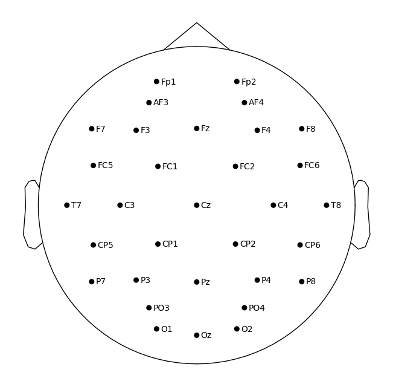
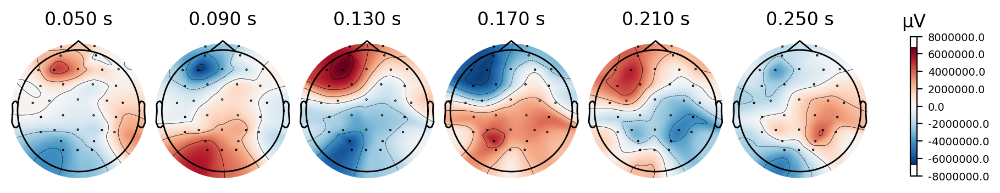
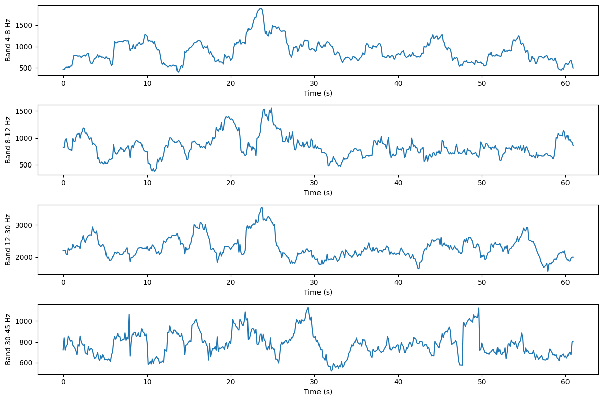

# Emotion-Recognition Using EEG Signals. 

Supervised by **Professor**: [Mohammad Ghassemi](https://ghassemi.xyz/)

# Table of Contents
- [Instructions To use the code](#Instructions-To-use-the-code)
- [About DEAP Dataset](#About-DEAP-Dataset)
- [EDA](#EDA-for-the-Data)
- [power spectral density plot](#power-spectral-density-plot)
- [Pre-processing](#Pre-processing)
- [CNN Architecture and CNN+LSTM Architecture](#CNN-Architecture-and-CNN+LSTM-Architecture)
- [Results](#Results)

## Instructions To use the code

1. The .ipynb notebooks are for pedagogocal reasons on how each part of the code works.
2. the .py files are for effortlessly reproducing the results.

#### Now let's look at how we can reproduce the results using the Python scripts. 

**Step 1**: Use the `pre-processing .ipynb` to get the numpy files of all the subjects present in the dataset.

**Step 2**: now run the script `data.py` to. 

```
python data.py --input_directory /home/mohan/Downloads/data_preprocessed_python/pre_data/ --num_subjects 5 --output_directory ./
```
here the `data.py` file takes 3 arguments. 
1. input directory to the pre-processed files.
2. select the number of subjects that we want (1-30)
3. An output directory that can be mentioned. we can also skip this part and a default folder would be created called 'Data_selected`

**Step 3**: run the script `data-split.py`.

```
python data-split.py --input_directory /home/mohan/Desktop/Data_selected --output_directory
```
This step takes the select data and then converts the data into train and test split numpy files. The default output directory is named as TrainTestfiles

**Step 4**: 2 models are being proposed here. To run the model one (CNN) run the script `cTrain.py`. this code performs 5-fold cross-validation  on training data that is 85% and performs a test on 15% of the data. 

```
python cTrain.py --data_directory ./Traintestfiles --emotion 0 
```
For training the network we need to provide where the data is present that is data directory and also select the emotion that we want to train our model for. 

- emotion 0 - Arousal
- emotion 1 - Valence
- emotion 2 - Dominance
- emotion 3 - Liking

After training the cnn model the results on cross-validation and the model's weights are saved in a new folder named results. it also contains a confusion matrix on the test data. 

**Step 5**: To run another model (CNNLSTM) run the script `cLtrain.py`. this code performs the same as ctrain.py however, we use a new proposed model here. 

After training the cnnlstm model the results on cross-validation and the model's weights are saved in a new folder named Lresults. it also contains a confusion matrix on the test data. 

**Step 6** If you want to train the proposed models without cross-validation you can just run the train.py file to train on the cnn model. the commands are the same as steps 4 and 5.


## About DEAP Dataset. 

1. **Multimodal Dataset**: The DEAP dataset is a multimodal dataset for analyzing human emotional states. It includes physiological signals and self-reported emotional ratings.

2. **Physiological Signals**: The dataset contains electroencephalogram (EEG) data recorded from 32 channels, along with other physiological signals such as galvanic skin response (GSR), heart rate, and facial electromyography (EMG).

3. **Emotional Stimuli**: Participants in the study were exposed to 40 one-minute-long video clips, which served as emotional stimuli. These videos were selected to elicit varied emotional responses.

4. **Research Applications**: The DEAP dataset is widely used in affective computing and neuroscience research, particularly for studies focusing on emotion recognition, human-computer interaction, and the analysis of physiological correlates of emotions.

### What should be used as Input and what can be expected as an output from the EEG data?

**INPUT-X**

This is for a single participant. For example - 's01.dat' file. we have 32 such files  

1. **Video Trials**: Each subject watches a video, and their brain's response (in the form of EEG signals) is recorded. This is like measuring how the brain 'reacts' to what it sees in the video.

2. **Time Series of Length 8064**: A time series is just a set of data points collected over time. In this case, each data point is an EEG reading. The length of 8064 means there are 8064 data points for each trial. This number comes from recording the brain's activity at a rate of 128 times per second `(128 Hz)` for 63 seconds. So, `( 128 X 63 = 8064 )` data points in total for each video trial.

3. **32 Electrodes**: Electrodes are like tiny sensors placed on the subject's head to pick up the EEG signals. Using 32 electrodes means the researchers are getting a comprehensive view of the brain's activity from 32 different points/channels on the scalp and this data is collected for 40 different subjects.

4. There are 40 channels present in the data. However, we are only choosing 32 channels for training our dataset. the rest of the 8 channels are other physiological signals that are not relevant to EEG data. The goal of the project is to use EEG signals to detect the emotional state. For this reason, we are using 32 channels from the data. 

5. **Total Data Generated**: For each subject, they generate data for every combination of the 40 videos and 32 Channels. So, for each subject, the total amount of data points is `( 40 {videos} X 32 {channels} X 8064 {data points/video})`. This is the total data collected from one subject across all the video trials.

In simple terms, this experiment involves recording how the brain of each subject responds to 40 different videos, using 32 sensors on their head, and collecting a very detailed set of data (8064 points) for each video. This results in a large amount of data for each person, reflecting their brain's activity throughout each video.

**OUTPUT-Y**

* The shape of the labels array `(40, 4)` in the DEAP dataset represents a two-dimensional array with specific dimensions:

1. **First Dimension (40)**: This dimension represents the number of stimuli or trials. where participants are exposed to different video clips, this could mean there are 40 different trials or video clips for which the labels are provided.

2. **Second Dimension (4)**: This dimension indicates that there are 4 labels (or features) associated with each trial.
   - **Arousal**: How activated or stimulated the participant is.
   - **Valence**: The pleasantness or unpleasantness of the emotion.
   - **Dominance**: The degree of control or power the emotion conveys.
   - **Liking**: The level of preference or enjoyment.

Therefore, each row in this array corresponds to a specific trial, and each column provides a specific label or rating for that trial, capturing different aspects of the participant's emotional response to the stimulus. 

#### Potential Challenges While dealing with the data. 

1. **High Dimensionality**: The DEAP dataset includes multiple channels of EEG data plus additional physiological signals. Handling such high-dimensional data requires robust feature selection and dimensionality reduction techniques to avoid model overfitting and to enhance computational efficiency.

2. **Signal Preprocessing**: EEG and other physiological signals often contain noise and artefacts (like muscle movement or eye blinks). Proper preprocessing (filtering, artefact removal) is crucial to ensure the quality of the data before analysis.

3. **Subject Variability**: Different individuals may exhibit varying physiological responses to the same emotional stimuli. This inter-subject variability can complicate the training of generalized models.

4. **Generalizability**: Models trained on a specific dataset may not perform well on data from different sources due to differences in data collection protocols, demographic variations, and equipment used. So the main goal of the project is to recognize the patterns of the EEG signals to detect the emotional states.

5. **Class Imbalance**: The authors in the paper, decided to label the the above 4 classes as between high and low values. However, not all emotions were equally balanced between low and high. This means that more videos were rated as high than low for some emotions. For example, 59% of the videos were rated as high arousal, 57% as high valence, and 67% as high liking. The percentages and standard deviations (which show how much variation there is) indicate that the distribution of high and low ratings wasn't even. Some emotions were more likely to be rated as high than others. This kind of imbalance can make it a bit more challenging to analyze the data and train models, as the models might become biased towards the more common category (like high arousal or high liking).

### EDA for the Data. 

Exploratory Data Analysis (EDA) is important for signals and signal processing for several reasons:

1. **Understanding Signal Characteristics:** EDA helps in gaining a deeper understanding of the fundamental characteristics of a signal. This includes examining its amplitude, frequency, phase, and other important properties. By visualizing the signal and its components, you can identify patterns and anomalies that might not be apparent from raw data.

2. **Noise Detection and Removal:** Signals are often noise-contaminated, which can distort the underlying information. EDA can help in identifying and characterizing noise in a signal, allowing for the development of noise removal or filtering techniques to enhance the quality of the signal.

3. **Frequency Analysis:** EDA techniques like Fourier analysis and spectrograms are commonly used to analyze the frequency content of signals. This is crucial for tasks such as identifying dominant frequencies, harmonics, and periodicity in signals. It is particularly useful in fields like audio processing, telecommunications, and vibration analysis.

4. **Visualization:** Visualizing signals and their properties can make it easier to spot trends, outliers, or irregularities. Various visualization techniques, such as time-domain and frequency-domain plots, can provide valuable insights.

5. **Data Preprocessing:** EDA often involves data preprocessing steps like filtering, resampling, or normalization. These steps can improve the quality and consistency of signal data before it is used for more advanced analyses or modelling.

Here we plot the raw signal data for subject 01 across the 40 channels to see what the data looks like. (open the subject 01.png file to view the plots for each channel.)

### power spectral density plot

Before we plot the the PSD we should know about the frequency bands that are used for this plot and tell us the reason why they are important. 

**why are these bands important here**

The frequency bands in EEG data – Theta, Alpha (both slow and regular), Beta, and Gamma – each have distinct characteristics and are associated with different types of brain activity. Understanding these bands can provide insights into cognitive processes, mental states, and potential neurological conditions. Here's a brief overview of each:

1. **Theta (4-8 Hz)**: 
   - **Characteristics**: Theta waves are typically slow and of high amplitude.
   - **Associated with**: Drowsiness, creativity, meditation, and, in some cases, the early stages of sleep. In children, theta activity is more prominent and can be a normal part of brain development. Excessive theta activity in adults, especially in awake states, might indicate potential neurological issues.

2. **Slow Alpha (8-10 Hz)** and **Alpha (8-12 Hz)**:
   - **Characteristics**: Alpha waves are smoother and slower than beta waves.
   - **Associated with**:
     - **Relaxed and restful states**: Often observed when a person is calm, relaxed, or in a state of light meditation. 
     - **Idling brain**: Commonly seen when eyes are closed and the person is not actively processing information.
   - **Differences between Slow and Regular Alpha**: Slow alpha waves are at the lower end of the alpha range and may appear in more relaxed states compared to the slightly faster regular alpha waves.

3. **Beta (12-30 Hz)**:
   - **Characteristics**: Beta waves are of lower amplitude and are faster than alpha and theta waves.
   - **Associated with**:
     - **Active, busy, or anxious thinking**: Present during focused mental activities, problem-solving, judgment, decision making, and active concentration.
     - **Alertness**: Linked with a state of alertness and attentiveness.
   - **Note**: Excess beta activity may be associated with anxiety or restlessness.

4. **Gamma (30+ Hz)**:
   - **Characteristics**: Gamma waves are the fastest and can be of low amplitude.
   - **Associated with**:
     - **Cognitive functions**: Involved in higher mental activity, including perception, problem-solving, fear, and consciousness.
     - **Information processing**: Thought to be important for integrating information from different parts of the brain.

Each of these bands plays a role in different brain functions and states of consciousness. Analyzing the patterns and dominance of these bands in specific areas of the brain can help in understanding cognitive processes, emotional states, and even in diagnosing neurological conditions. However, it's important to interpret these signals within the broader context of the individual's health, behavior, and specific circumstances of the EEG recording.




- From the above plot we can eaily see the Following. 

1. **Frequency Content:**
   - The x-axis of the plot represents frequency in Hertz (Hz).
   - The y-axis represents the power or amplitude of the signal at each frequency.

2. **Dominant Frequencies:**
   - Peaks in the PSD plot indicate dominant frequencies in the signal.
   - These peaks can correspond to specific neural oscillations such as delta (0.5-4 Hz), theta (4-8 Hz), alpha (8-13 Hz), beta (13-30 Hz), or gamma (>30 Hz).

3. **Artifacts:**
   - Unwanted artifacts, such as line noise or muscle activity, may manifest as peaks at specific frequencies.
   - Identifying these peaks can help in detecting and mitigating artifacts in the data.

4. **Power Changes Over Time:**
   - Changes in power across frequencies can provide insights into dynamic shifts in brain activity.
   - Variations in different frequency bands may correspond to different cognitive states or tasks.

5. **Filtering Considerations:**
   - The plot may help in deciding appropriate frequency ranges for filtering the data based on the analysis goals.

6. **Overall Signal Quality:**
   - The overall shape and smoothness of the PSD plot can provide a qualitative assessment of the signal quality.
   - Abrupt changes or irregularities may indicate potential issues with data recording or preprocessing.

Here, we notice that there is a sharp change in between the 20 and 25 Hz which indicate that there might be a change in the brain signals or it might be noise. In the rest of the plot it can be easily seen that most of the frequences range in the same range. This tells us that it is difficult to figure out an what frequency of waves effect the output. 

**The plots from the basic subject01 is often difficult to understand what is going on. To make this plot more easy to understand we see that using Topographical plots across time will help us gain more information.**

1. **Electrode Placement:** Topographical plots in EEG (Electroencephalogram) display the spatial distribution of electrical activity across the scalp. These plots use color-coded or contour lines to represent the strength or amplitude of EEG signals at different electrode locations. Areas with higher signal amplitudes are often shown with brighter colors or closer contour lines, while lower amplitudes are represented with darker colors or wider spacing.

2. **Electrode Density:** The number and placement of electrodes on the scalp influence the level of detail in EEG topographical plots. A higher density of electrodes provides more precise information about brain activity at specific scalp regions, while a lower density offers a more generalized view of the brain's electrical patterns.

3. **Applications:** This helps researchers visualize and analyze brain activity, identify specific neural patterns, and assess changes in response to stimuli or tasks. EEG topographical maps aid in understanding brain function, diagnosing disorders like epilepsy, and monitoring cognitive processes during tasks like memory or language processing studies.

**Plot for Electrode Placement over the scalp**



**Now we see the plot for the alpha band across the time**



In pre-processing notebook, there are many different plots across different timelines and using distinct bands. From these plots we can see how the activity of the brain changes with respect to the time and the electrode position. 

## Pre-processing - 

We use a function, named `FFT_Processing`, which is designed to process EEG data using Fast Fourier Transform (FFT) and create a dataset for machine learning analysis.

Steps for the process - 

1. **Windowed FFT Analysis:**
   - It performs FFT analysis on windowed segments of the EEG data.
   - The window size and step size are specified by the `window_size` and `step_size` parameters.
   - For each specified EEG channel (`channel`), it extracts a segment of data, applies FFT to obtain power spectral density in specified frequency bands (`band`), and flattens the result into a 1D array.
   - This results in a feature vector (`meta_data`) for each time window.

2. **Create Meta-Data Array:**
   - It creates a meta-data array (`meta_array`) that contains the feature vector (`meta_data`) and the corresponding labels.
   - This array represents the features and labels for a specific time window within a trial.

3. **Data Collection:**
   - The meta-data arrays for all time windows and trials are collected into a list (`meta`).

4. **Convert and Save Data:**
   - The list of meta-data arrays is converted into a NumPy array (`meta`) and saved as a binary `.npy` file.
   - The saved file is named based on the subject identifier.

In summary, the function processes EEG data from a subject, performs windowed FFT analysis to extract features, and creates a dataset suitable for machine learning analysis. The resulting dataset can be used to train and evaluate machine learning models for tasks such as classification.

Here is the plot on how we convert each channel in the data into different bands. 



The above transformation is done across the 32 channels for each trail in the whole dataset. 

### ***CNN Architecture and CNN+LSTM Architecture***

- TODO

### ***Results ***

## Model Training Results
- **Split**: 80-20 train-test
- **Learning Rate**: 0.001
- **Optimizer**: Adam
- **Loss Function**: CrossEntropyLoss
- **Batch Size**: 256

### Custom CNN Model for 4 Emotions (Trained on 30 Subjects)
| Emotion | Epochs | Training Accuracy | Validation Accuracy | F-1 Score |
|---------|--------|-------------------|---------------------|-----------|
| Arousal | 200    | 69.44%            | 75.77%              | 0.69      |
| Valence | 200    | 70.45%            | 76.37%              | 0.70      |
| Dominance | 200    | 70.82%          | 76.08%              | 0.70      |
| Liking | 200    | 69.79%            | 75.28%              | 0.69      |

### Custom CNN Model for 4 Emotions (Trained on 15 Subjects)
| Emotion | Epochs | Training Accuracy | Validation Accuracy | F-1 Score |
|---------|--------|-------------------|---------------------|-----------|
| Arousal | 200    | 83.28%            | 85.14%              | 0.83      |
| Valence | 200    | 83.17%            | 85.19%              | 0.83      |
| Dominance | 200    | 82.81%          | 84.59%              | 0.82      |
| Liking | 200    | 84.14%            | 85.74%              | 0.84      |

### CNN+LSTM Models for Emotions (Trained on 30 Subjects)
| Emotion | Epochs | Training Accuracy | Validation Accuracy | F-1 Score |
|---------|--------|-------------------|---------------------|-----------|
| Arousal | 100    | 97.08%            | 91.08%              | 0.97      |
| Valence | 100    | 96.40%            | 90.7%               | 0.96      |
| Dominance | 100    | 96.48%          | 91.06%              | 0.96      |
| Liking | 100    | 96.03%            | 90.3%               | 0.96      |

### Applying cross-validation using cnnlstm model. 

**1. For the emotion - Arousal**

| Fold | Training Accuracy   |  Validation Accuracy | F-1 Accuracy score (Validation) |
|------|------------------------|-----------------------------|--------------------------------|
| 0    | 96.19%                 | 87.41%                      | 0.874062                       |
| 1    | 96.19%                 | 86.86%                      | 0.868737                       |
| 2    | 95.68%                 | 86.45%                      | 0.864480                       |
| 3    | 95.87%                 | 86.63%                      | 0.866859                       |
| 4    | 96.81%                 | 87.79%                      | 0.877870                       |

**2. For the emotion - Valence**

| Fold | Training Accuracy | Validation Accuracy | Final F1 Accuracy (Validation) |
|------|-------------------|---------------------|--------------------------------|
| 0    | 95.66%            | 86.99%              | 0.869876                       |
| 1    | 94.90%            | 85.45%              | 0.854516                       |
| 2    | 93.98%            | 85.06%              | 0.850776                       |
| 3    | 94.72%            | 85.78%              | 0.857825                       |
| 4    | 94.50%            | 85.65%              | 0.856606                       |

**3. For the emotion - Dominance**

| Fold | Training Accuracy | Validation Accuracy | Final F1 Accuracy (Validation) |
|------|-------------------|---------------------|--------------------------------|
| 0    | 94.47%            | 85.49%              | 0.854965                       |
| 1    | 95.43%            | 86.69%              | 0.866824                       |
| 2    | 95.59%            | 86.61%              | 0.866053                       |
| 3    | 95.29%            | 86.82%              | 0.868481                       |
| 4    | 96.02%            | 87.53%              | 0.875541                       |

**4. For the emotion - Liking.**

| Fold | Training Accuracy | Validation Accuracy | Final F1 Accuracy (Validation) |
|------|-------------------|---------------------|--------------------------------|
| 0    | 93.51%            | 84.57%              | 0.845662                       |
| 1    | 95.59%            | 86.75%              | 0.867604                       |
| 2    | 95.17%            | 86.40%              | 0.864050                       |
| 3    | 93.96%            | 84.94%              | 0.849290                       |
| 4    | 94.46%            | 85.59%              | 0.856038                       |


   


